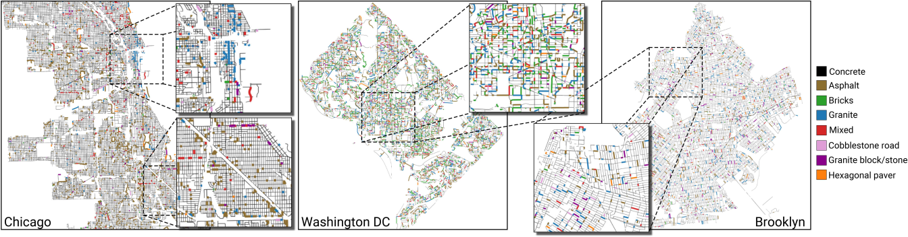
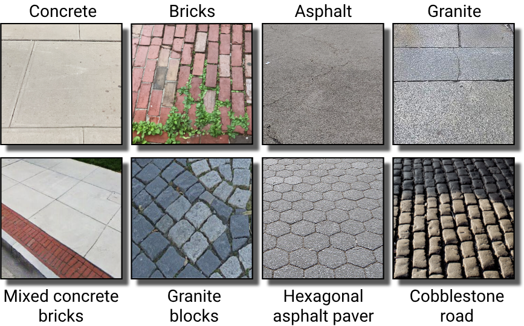
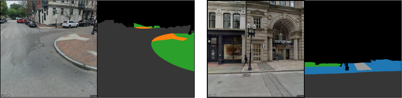

# CitySurfaces: City-scale Semantic Segmentation of Sidewalk Surfaces

<p align="center">

</p>

CitySurfaces is a framework that combines active learning and semantic segmentation to locate, delineate, and classify sidewalk paving materials from street-level images.
Our framework adopts a recent high-performing semantic segmentation model (Tao et al., 2020), which uses hierarchical multi-scale attention combined with object-contextual representations

The framework was presented in our [paper](https://arxiv.org/abs/2201.02260) published at the *Sustainable Cities and Society* journal: 

**CitySurfaces: City-scale semantic segmentation of sidewalk materials**\
Maryam Hosseini, Fabio Miranda, Jianzhe Lin, Claudio T. Silva, 
*Sustainable Cities and Society, 2022*

You can use our pre-trained model to make inference on your own street-level images. Our extended model can classify eight different classes of paving materials:

<p align="center">

</p>

The team includes:

* [Maryam Hosseini](https://maryamhosseini.me) (Rutgers University / New York University)
* [Fabio Miranda](https://fmiranda.me) (University of Illinois at Chicago)
* Jianzhe Lin (New York University)
* [Cláudio T. Silva](https://vgc.poly.edu/~csilva/) (New York University)

## Table of contents

   * [Updates](#updates)
   * [Installing prerequisites](#installing-prerequisites)
   * [Run inference on your own data](#run-inference-on-your-own-data)

## Updates

New weights from our updated model trained on more cities (now including DC, Chicago, and Philadelphia) is uploaded in our [Google Drive](https://drive.google.com/drive/folders/1W5STd9JmVZkAsSN3TidOMMrv7aZtR-4_?usp=sharing). 


## Installing prerequisites

The framework is based on [NVIDIA Semantic Segmentation](https://github.com/NVIDIA/semantic-segmentation). The code is tested with pytorch 1.7 and python 3.9. You can use ./Dockerfile to build an image.

## Run inference on your own data 

Follow the instructions below to be able to segment your own image data. Most of the steps are based on NVIDIA's original steps, with modifications regarding weights and dataset names.

### Download Weights

* Create a directory where you can keep large files.
```bash
  > mkdir <large_asset_dir>
```

* Update `__C.ASSETS_PATH` in `config.py` to point at that directory

  __C.ASSETS_PATH=<large_asset_dir>

* Download our pretrained weights from [Google Drive](https://drive.google.com/drive/folders/1W5STd9JmVZkAsSN3TidOMMrv7aZtR-4_?usp=sharing). Weights should be under `<large_asset_dir>/seg_weights`.

### Running the code

The instructions below make use of a tool called `runx`, which we find useful to help automate experiment running and summarization. For more information about this tool, please see [runx](https://github.com/NVIDIA/runx).
In general, you can either use the runx-style commandlines shown below. Or you can call `python train.py <args ...>` directly if you like.


### Inference

Update the `inference-citysurfaces.yml` under scripts directory with the path to your image folder that you would like to make inference on. 

Run 
```bash
> python -m runx.runx scripts/inference-citysurfaces.yml -i
```

The results should look like the below examples, where you have your input image and segmentation mask, side by side. 

<p align="center">

</p>
